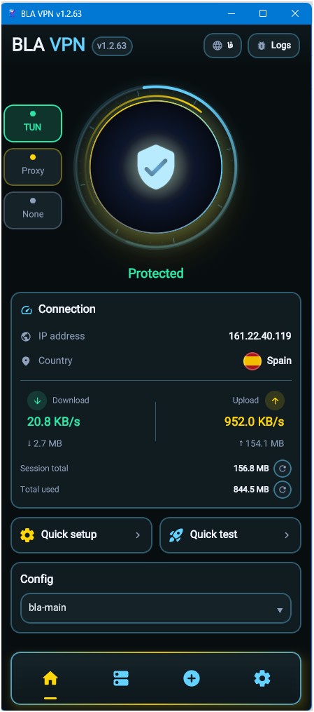

  

<h1 align="center">BLA VPN</h1>

  <strong>Windows desktop client</strong> for VLESS / VMess / Trojan / Shadowsocks 
  TUN · system proxy · TLS fragment · subscriptions

  
  
  

  <a href="https://github.com/davoodtaba-glitch/BLA-VPN-Desktop/releases/latest"><strong>Download latest release</strong></a>
  ·
  <a href="https://t.me/blavpn">Telegram</a>

---

## Features

- **TUN** full-system VPN (TAP-Windows) or **Proxy** / **None**
- VLESS, VMess, Trojan, Shadowsocks, REALITY, XHTTP, gRPC
- TLS fragment (anti-DPI) presets + custom packets / length / interval
- Subscriptions with traffic & expiry, import links / JSON
- Live speed, session + lifetime totals, public IP & country
- System tray, run at Windows startup, EN / FA UI
- Connectivity tests (Iran / Google) and in-app GitHub update check

## Requirements

- Windows 10 / 11 (x64)
- **Administrator** for TUN mode (TAP adapter + routes)
- TAP-Windows driver — install from **Settings → Install TAP driver**

## Install

1. Open [Releases](https://github.com/davoodtaba-glitch/BLA-VPN-Desktop/releases/latest)
2. Download the portable zip
3. Extract and run **`BLA VPN.exe`**

No installer required. Settings live next to the exe (`data\`).

## Connection modes

| Mode | What it does |
|------|----------------|
| **TUN** | Full VPN via TAP + tun2socks. Needs admin + TAP driver. |
| **Proxy** | Windows system proxy → local HTTP inbound. No admin. |
| **None** | Local SOCKS/HTTP only — point apps at the ports in Settings. |

## Quick start

1. **Import** a `vless://` / `vmess://` / `trojan://` / `ss://` link or subscription URL  
2. Pick the config on Home  
3. Choose **TUN** or **Proxy**  
4. Tap the shield to connect  

## Links

- Releases: https://github.com/davoodtaba-glitch/BLA-VPN-Desktop/releases  
- Telegram: https://t.me/blavpn  

## License

Use at your own risk. You are responsible for complying with local laws.
